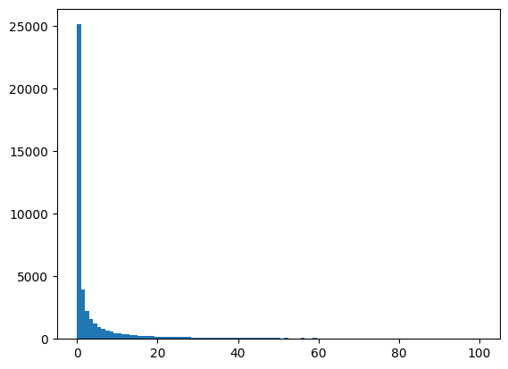
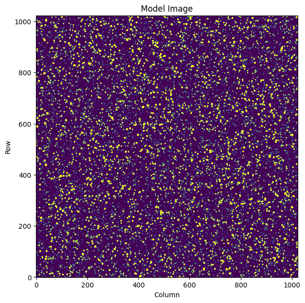
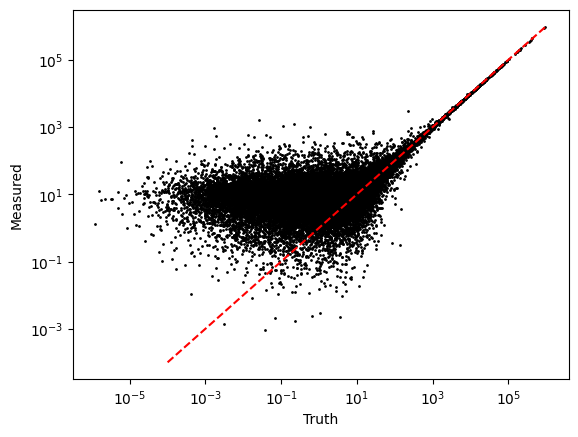
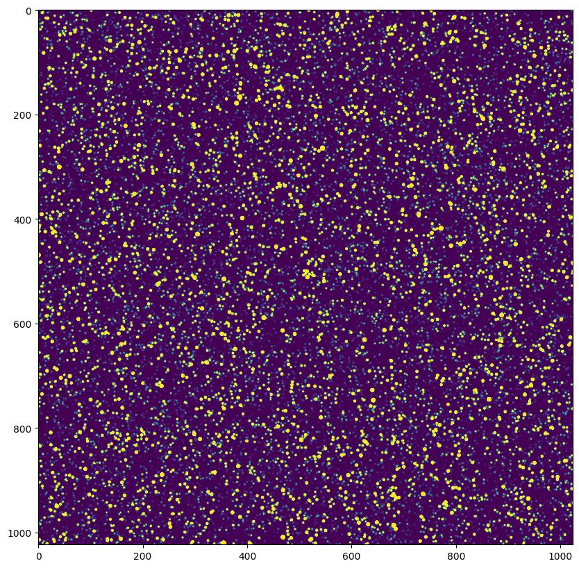

# Using `Sparse3D`


```python
import numpy as np
import matplotlib.pyplot as plt
from sparse3d import Sparse3D

from scipy import sparse
```

Let's imagine a scenario where we are trying to model a large astronomy image. Let's set up some image dimensions, and a number of targets to model.

We'll need to have some model for the source shape. Let's pick a simple 2D Gaussian for now, with a standard deviation of 2 pixels. 


```python
imshape = (1024, 1024)
nsources = 50000
source_brightness = 10**np.random.normal(0, 1.5, size=nsources)# * 10
source_row, source_col = np.random.uniform(0, 1024, size=(nsources, 2)).T
sigma = 1
```


```python
plt.hist(source_brightness, np.linspace(0, 100, 100));
```


    

    


If we want to model this, we have to

1. Create a model for each source
2. Add the sources together

This will require that we evaluate the Gaussian function for 50000 sources, and evaluate it out to some distance. If we try to calculate the full model across all the pixels possible we will end up with a very slow calculation. 

Let's use Sparse3D to calculate it.

First let's decide how far out from each source we want to evaulate the model. Given that we're going to use a Gaussian, we'll go out 5 standard deviations from each side.


```python
subimage_size = sigma * 5 * 2
```

We need the indices in row and column for each sub image around a star. This needs to be in integer, pixel positions. 

We're obtain the integer row and column position for each source, and then the phase in that pixel.


```python
source_row_int, source_row_phase = np.floor(source_row).astype(int), source_row % 1
source_col_int, source_col_phase = np.floor(source_col).astype(int), source_col % 1
```

Then we can create the grid of pixel offsets


```python
R, C = np.mgrid[:subimage_size, :subimage_size] - subimage_size//2
```


```python
R
```


    array([[-5, -5, -5, -5, -5, -5, -5, -5, -5, -5],
           [-4, -4, -4, -4, -4, -4, -4, -4, -4, -4],
           [-3, -3, -3, -3, -3, -3, -3, -3, -3, -3],
           [-2, -2, -2, -2, -2, -2, -2, -2, -2, -2],
           [-1, -1, -1, -1, -1, -1, -1, -1, -1, -1],
           [ 0,  0,  0,  0,  0,  0,  0,  0,  0,  0],
           [ 1,  1,  1,  1,  1,  1,  1,  1,  1,  1],
           [ 2,  2,  2,  2,  2,  2,  2,  2,  2,  2],
           [ 3,  3,  3,  3,  3,  3,  3,  3,  3,  3],
           [ 4,  4,  4,  4,  4,  4,  4,  4,  4,  4]])


```python
R.shape
```


    (10, 10)


This defines the pixel indices in our sub array. 

The integer row and column position in 3D for **each source** is then given as


```python
row3d = R[:, :, None] + source_row_int
col3d = C[:, :, None] + source_col_int
```


```python
row3d.shape
```


    (10, 10, 50000)


We can see that the shape of this array is (10, 10, 100000) which is (nrows, ncolumns, nsources).

If we look at the first source we get


```python
row3d[:, :, 0]
```


    array([[131, 131, 131, 131, 131, 131, 131, 131, 131, 131],
           [132, 132, 132, 132, 132, 132, 132, 132, 132, 132],
           [133, 133, 133, 133, 133, 133, 133, 133, 133, 133],
           [134, 134, 134, 134, 134, 134, 134, 134, 134, 134],
           [135, 135, 135, 135, 135, 135, 135, 135, 135, 135],
           [136, 136, 136, 136, 136, 136, 136, 136, 136, 136],
           [137, 137, 137, 137, 137, 137, 137, 137, 137, 137],
           [138, 138, 138, 138, 138, 138, 138, 138, 138, 138],
           [139, 139, 139, 139, 139, 139, 139, 139, 139, 139],
           [140, 140, 140, 140, 140, 140, 140, 140, 140, 140]])


i.e. the row position for the first source.

We need to build our model. Our model is given as

$$
f(x, y) = \frac{1}{2 \pi \sigma_x \sigma_y} \exp \left( -\frac{1}{2} \left( \frac{(x - \mu_x)^2}{\sigma_x^2} + \frac{(y - \mu_y)^2}{\sigma_y^2} \right) \right)
$$

where $dx$ and $dy$ indicate the distance from the source position in x and y.

Let's create arrays for both the $x$ and $y$ terms


```python
x3d = R[:, :, None] * np.ones(nsources)
y3d = C[:, :, None] * np.ones(nsources)
```


```python
X = Sparse3D(data=x3d, row=row3d, col=col3d, imshape=imshape)
Y = Sparse3D(data=y3d, row=row3d, col=col3d, imshape=imshape)
```


```python
X
```


    <(1024, 1024, 50000) Sparse3D array of type float64>


```python
L = np.exp(-0.5*((X - source_row_phase)**2/sigma**2 + (Y - source_col_phase)**2/sigma**2)) * 1/(2*np.pi * sigma**2)
```


```python
L
```


    <(1024, 1024, 50000) Sparse3D array of type float64>


`L` is now a matrix containing our 50000 targets. Each target is only valued in a small region, close to the target center. For us to convert this into a flat image containing all the sources at a given brightness, we just use the dot product.


```python
model_image = l.dot(source_brightness)
```

If we plot this new model image, we see all the sources!


```python
fig, ax = plt.subplots(figsize=(7, 7))
ax.imshow(model_image, vmin=0, vmax=10, origin='lower');
ax.set(xlabel='Column', ylabel='Row', title='Model Image')
```


    [Text(0.5, 0, 'Column'), Text(0, 0.5, 'Row'), Text(0.5, 1.0, 'Model Image')]


    

    


Let's try imagining this is real data. We can add some noise, and then use our matrix to fit the data.


```python
fake_data = np.random.poisson(model_image) + np.random.normal(0, 3, size=model_image.shape).astype(int)
```

I've sampled the image using poisson noise to simulate observing real stars, and I've added in a small Gaussian noise to act as "read noise".

We now want to fit the brightness of each star. In this contrived case, I have a perfect model for the data (I made the data!), let's extract the flux for these targets. 

We'll fit this by converting our Sparse3D matrix to a `sparse.csr_matrix` which will give us a 2D matrix, and then we can do our regular linear algebra.. 


```python
Lc = L.tocsr()
```

Let's look at the difference between these two arrays:


```python
L
```


    <(1024, 1024, 50000) Sparse3D array of type float64>


```python
Lc
```


    <1048576x50000 sparse matrix of type '<class 'numpy.float64'>'
    	with 4975448 stored elements in Compressed Sparse Row format>


Note this new matrix has shape (npixels, nsources). 

We've converted it so we can use linear algebra functions. We can use simple linear algebra to fit our fake data and find the 50000 sources.


```python
%%time
best_fit_weights = sparse.linalg.spsolve(Lc.T.dot(Lc), sparse.csc_matrix(Lc.T.dot(fake_data.ravel())).T)
```

    CPU times: user 1.29 s, sys: 32.6 ms, total: 1.32 s
    Wall time: 1.32 s


```python
len(best_fit_weights)
```


    50000


You can see we've fit 50,000 stars in this image in less than 2 seconds. Let's plot the fit against the truth.


```python
fig, ax = plt.subplots()
ax.scatter(source_brightness, best_fit_weights, s=1, c='k')
ax.plot([1e-4, 1e6], [1e-4, 1e6], c='r', ls='--')
ax.set(yscale='log', xscale='log', xlabel='Truth', ylabel='Measured');
```


    

    


This looks great! Bright sources have very similar flux to the expected flux, but fainter sources are more noisy as we get towards the read noise limit of the data. 

Of course, in this contrived case, I know the true model. In reality, we won't actually know the PSF model, or the exact location of the stars. But you can see given real data and an approximate model how this can be recreated. 

## Hints 1: Efficiency

Keep in mind every operation you do on one of these objects is costing some time to remake the object.

For example
```python
Sparse3D + 1 + np.ones(10) + 324
```

is less efficient than
```python
Sparse3D + (1 + np.ones(10) + 324)
```

so you can improve efficiency by calculating as much as you can in numpy, then casting into a `Sparse3D` object


```python
dX1 = Sparse3D(-0.5 * (x3d - source_row_phase)**2/sigma**2, row3d, col3d, imshape=imshape)
dY1 = Sparse3D(-0.5 * (y3d - source_col_phase)**2/sigma**2, row3d, col3d, imshape=imshape)
```


```python
l = np.exp(dX1 + dY1) * (1/(2*np.pi * sigma**2))
```


```python
plt.figure(figsize=(10, 10))
plt.imshow(l.dot(source_brightness), vmin=0, vmax=10);
```


    

    

