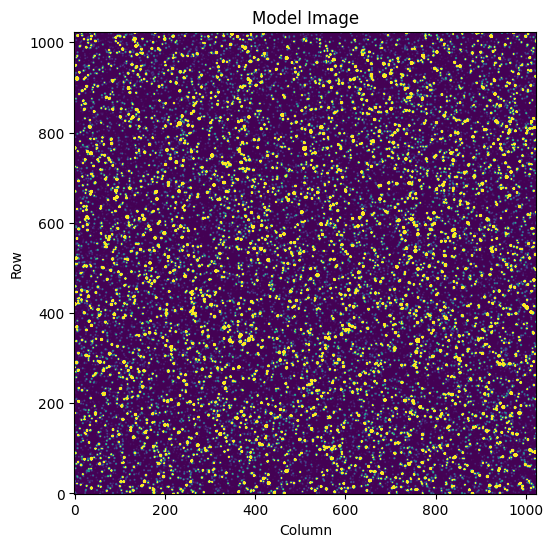

# Summary

Astronomical images can often be treated as a set of small, dense images of astronomical objects, such as stars, embedded in much larger images of the night sky. In astronomy we may treat astronomical images as a linear model; images are a design matrix of stellar point spread functions dotted with a vector of weights, which correspond to the star brightnesses. In this form, the design matrix has 3 dimensions; pixel row, pixel column, and source number. The processes of either modeling synthetic astronomical images or extracting the flux of targets from real astronomical images can both be made greatly more computationally efficient by capitalizing on their sparse nature.

`scipy.sparse`[@scipy] provides the facilities to work with 2D sparse matrices and provides many useful matrix operations. `sparse3d` is an open-source Python package that extends the functionality of the `scipy.sparse` library and provides a data structure for working with "3D" sparse matrices. Users pass `sparse3d` a dense data set evaluated in small sub images representing each astronomical target they need to model. `sparse3d` then handles embedding this dense 3D dataset inside a large matrix representing the full image. `sparse3d` is then able to provide users with the capability to "translate" the dense matrices around inside the larger sparse image, select particular "regions of interest" inside the larger image, and use `numpy`-like math operations on their matrices. Because `sparse3d` provides `numpy`-like math operations, users are able to efficiently build models for PSFs using mathematical models, such as Gaussians. `sparse3d` has a convenient API, and enables astronomy users to benefit from the efficiencies of `scipy.sparse` while using 3D matrices.

# Statement of need

Many existing and future astronomical surveys provide data that is highly crowded over large portions of the sky. Ground-based data from new facilities such as the Vera C. Rubin Observatory provide 20Tb of data each night, and the future NASA Roman mission will observe billions of stars in large 4096x4096 images. The NASA TESS mission provides data 2300 square degrees of the sky every month with a 200s cadence. Astronomers frequently want to access the brightness of targets in this data. It is valuable to model large numbers of stars jointly as they share certain properties (e.g. similar motion properties, and similar PSFs).

We can model these images as a simple linear model such as

$$f = A \cdot w$$

where $A$ is a design matrix consisting of a stack of images. If we have a detector with 2048 x 2048 pixels containing 10,000 stars then A has shape (2048, 2048, 10000). The vector of weights $w$ contains the brightness of each star and has length (10000). Building $A$ as a dense matrix to describe the scene is expensive. Instead, we capitalize on the fact that each image is only valued very close to each star and embed dense sub images inside a larger, sparse image.

`sparse3d` provides

* An intuitive API where dense sub-images can be embedded in a single matrix object while maintaining 3 dimensions to the user. This object exposes familiar matrix algebra from the `scipy.sparse` library.

* `numpy`-like math operations so that matrices can be intuitively combined, subtracted, and modified.

* Functions to conveniently translate the dense sub-images within the larger image.

* Functions to translate into `scipy.sparse` native objects.

# Example Usage

Below is an example usage of `sparse3d` which embeds small, dense subimages inside a 3D matrix, applies mathematical operations to those matrices to create a Gaussian PSF model, and then dots the matrix with flux weights to produce a model image. Creating the model can be done in under 1s for an image of size 1024 x 1024 pixels with 50,000 sources. Similarly, the synthetic model image can be fit with the same matrix using `scipy.sparse.linalg.spsolve` to recover the best fitting weights, this fit takes under 1.5s. The output of this example is shown in Figure \autoref{fig:example}.

```python
import numpy as np
import matplotlib.pyplot as plt
from sparse3d import Sparse3D

imshape = (1024, 1024)
nsources = 50000
sigma = 1
subimage_size = 10

# Row and Column positions within the subimage
R, C = np.mgrid[:subimage_size, :subimage_size] - subimage_size//2

# Simulated source properties
source_brightness, source_row, source_col = 
 10**np.random.normal(0, 1.5, size=nsources), *np.random.uniform(0, 1024, size=(nsources, 2)).T

# Pixel phase for each source
mu_x, mu_y = source_row % 1, source_col % 1

# Pixel number in row and column for each source
row3d = R[:, :, None] + np.floor(source_row).astype(int)
col3d = C[:, :, None] + np.floor(source_col).astype(int)
R3d = R[:, :, None] * np.ones(nsources)
C3d = C[:, :, None] * np.ones(nsources)

# Sparse3D objects representing the X and Y position for each sub image
X = Sparse3D(data=R3d, row=row3d, col=col3d, imshape=imshape)
Y = Sparse3D(data=C3d, row=row3d, col=col3d, imshape=imshape)

# Building a 2D Gaussian from the X and Y matrices
L = 1/(2*np.pi * sigma**2) * np.exp(-0.5*((X - mu_x)**2/sigma**2 + (Y - mu_y)**2/sigma**2))

# Create a model image using source brightnesses
model_image = L.dot(source_brightness)

# Plot the model image
fig, ax = plt.subplots(figsize=(6, 6))
ax.imshow(model_image, vmin=0, vmax=10, origin='lower');
ax.set(xlabel='Column', ylabel='Row', title='Model Image');
```



# Comparison to Existing Software

Sparse matrices have been used in several pipelines for astronomy applications, in particular in crowded fields. @tphot and @pampelmuse both provide crowded source photometry pipelines for working with large astronomical images. More recently, the pipeline for the Vera C. Rubin Observatory utilizes sparse matrices to improve the efficiency of source extraction, as discussed in @rubin. While existing pipelines do provide facilities to use sparse matrices with astronomy data, this functionality is embedded in large, detector-specific pipelines and the functionality is not available in a single, light-weight package.

# Acknowledgements

This work was funded through the NASA Pandora SmallSat. Funding for NASA Pandora is provided under the NASA Pioneers Program. Funding for this work is provided by NASA grant 80NSSC20M0192.

# References
